# BiHInsight – Android aplikacija za prikaz otvorenih podataka BiH

## Opis aplikacije

BiHInsight je Android aplikacija čija je svrha omogućiti korisnicima pregled, filtriranje, vizualizaciju i dijeljenje podataka sa Portala Otvorenih Podataka Bosne i Hercegovine (odp.iddeea.gov.ba). Aplikacija koristi Web API (CKAN/JSON) za dohvat podataka, omogućava rad offline putem lokalne baze (Room), te nudi moderan i intuitivan korisnički interfejs u skladu s Material 3 smjernicama.

Aplikacija je razvijena koristeći najnovije Android tehnologije i najbolje prakse, uključujući Jetpack Compose za korisnički interfejs, MVVM arhitekturu za odvajanje logike, Room bazu podataka za lokalno čuvanje, i Retrofit za komunikaciju sa API-jem. Ova kombinacija omogućava brz razvoj, lako održavanje i skalabilnost aplikacije.

---

## Arhitektura aplikacije (MVVM)

Aplikacija BiHInsight koristi Model-View-ViewModel (MVVM) arhitekturu, koja omogućava jasno odvajanje odgovornosti između različitih slojeva aplikacije. Ova arhitektura pruža bolje testiranje, održavanje i skalabilnost koda.

### Komponente MVVM arhitekture:

**Model sloj** predstavlja podatke i poslovnu logiku aplikacije. Uključuje:
- **Data Models** - Kotlin data klase koje predstavljaju strukturu podataka
- **Room Entities** - Entiteti za lokalnu bazu podataka
- **API Response Models** - Modeli za odgovore sa web API-ja

**View sloj** je odgovoran za prikaz korisničkog interfejsa i interakciju sa korisnikom. Koristi:
- **Jetpack Compose** - Moderni declarative UI framework
- **Composable funkcije** - Reusable UI komponente
- **State management** - Upravljanje stanjem UI-a kroz StateFlow

**ViewModel sloj** služi kao most između View i Model slojeva. Odgovoran je za:
- **Business logic** - Poslovna logika aplikacije
- **State management** - Upravljanje stanjem UI-a
- **Data transformation** - Transformacija podataka iz modela za prikaz
- **Lifecycle awareness** - Svjesnost životnog ciklusa aktivnosti

### Tok podataka u aplikaciji:

1. **UI Layer (Compose)** → poziva funkcije ViewModel-a
2. **ViewModel** → poziva Repository za podatke
3. **Repository** → koordinira između API-ja i lokalne baze
4. **API Service** → dohvaća podatke sa servera
5. **Room Database** → čuva podatke lokalno
6. **Data Flow** → podaci se vraćaju kroz isti put nazad do UI-a

### Prednosti korištenja MVVM arhitekture:

- **Separation of Concerns** - Jasno odvajanje odgovornosti
- **Testability** - Lako testiranje svakog sloja odvojeno
- **Maintainability** - Jednostavno održavanje i modifikacija
- **Scalability** - Lako dodavanje novih funkcionalnosti
- **Lifecycle Management** - Automatsko upravljanje životnim ciklusom

---

## Dijagram arhitekture

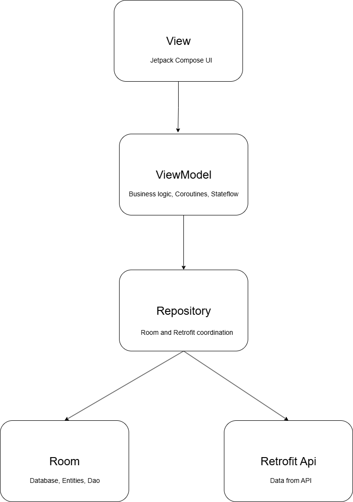

*Dijagram prikazuje MVVM arhitekturu aplikacije: View sloj (Jetpack Compose UI) komunicira sa ViewModel slojem (business logic, coroutines, stateflow), koji koordinira podatke kroz Repository sloj. Repository pristupa lokalnoj bazi (Room: Database, Entities, Dao) i udaljenom API-ju (Retrofit API: Data from API).*

---

## Funkcionalnosti aplikacije (sa screenshotovima)

### 1. Početni ekran / Home
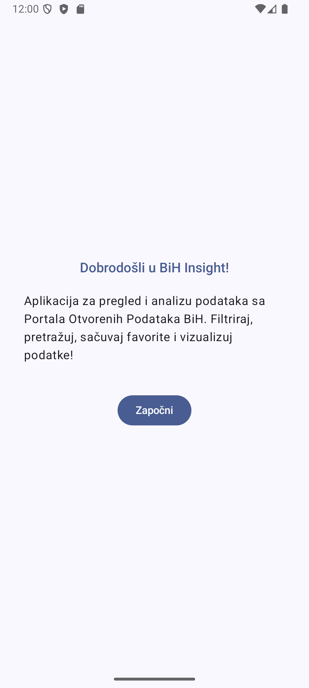

*Glavni ekran sa izborom datasetova i navigacijom ka ostalim funkcionalnostima. Korisnik može odabrati različite skupove podataka za pregled, uključujući izdate vozačke dozvole, podatke o novorođenčadi i registraciju osoba. Ekran prikazuje jasnu navigaciju ka svim dostupnim funkcionalnostima aplikacije.*

### 2. Detalji podatka
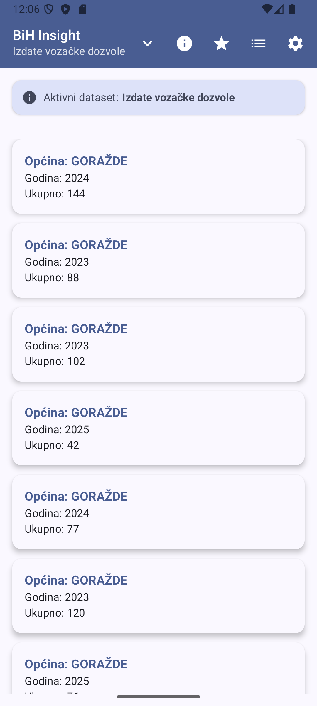

*Klikom na stavku iz liste otvara se detaljan prikaz sa svim informacijama o tom podatku. Ekran prikazuje sve relevantne informacije u organizovanom formatu, omogućava dijeljenje podataka, te nudi opciju dodavanja u favorite. Detaljni prikaz je optimizovan za čitljivost i korisničko iskustvo.*

### 3. Filteri i pretraga
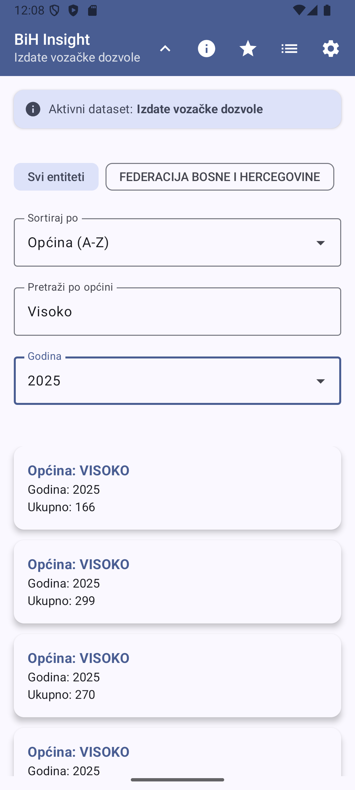

*Korisnik može filtrirati i pretraživati podatke po relevantnim kriterijima (npr. općina, status, period). Sistem filtriranja podržava više kriterija istovremeno, omogućava sortiranje rezultata, te pruža real-time pretragu. Filteri su intuitivni i omogućavaju brzo pronalaženje željenih podataka.*

### 4. Prikaz podataka (Lista)
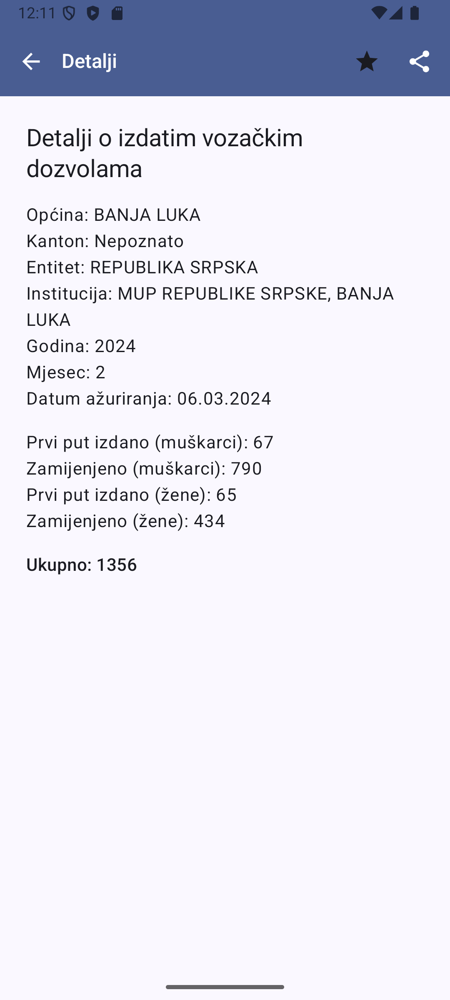

*Prikazuje listu podataka iz odabranog dataset-a. Omogućava filtriranje, sortiranje i pretragu. Lista je optimizovana za performanse sa LazyColumn, podržava pull-to-refresh funkcionalnost, te prikazuje loading stanja i error poruke. Svaka stavka u listi je klikabilna i vodi ka detaljnom prikazu.*

### 5. Izbor skupa podataka / Onboarding
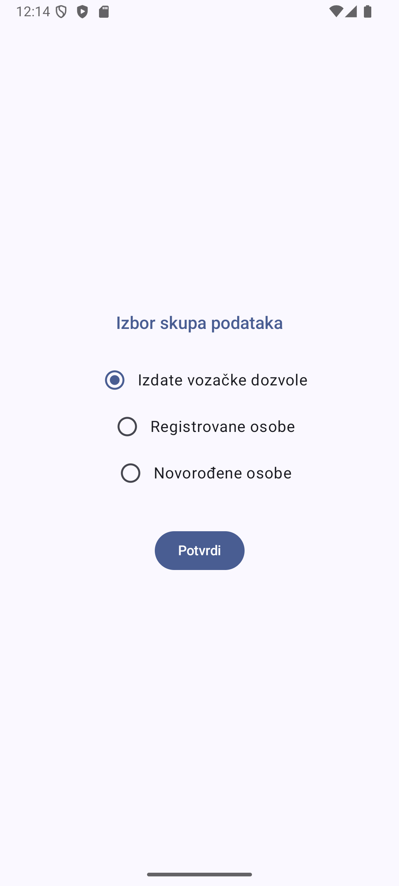

*Omogućava korisniku odabir preferencija ili početnog dataset-a. Prvi korak u personalizaciji iskustva. Ekran prikazuje sve dostupne skupove podataka sa kratkim opisima, omogućava jednostavan odabir, te pamti korisničke preferencije za buduće sesije.*

### 6. Favoriti
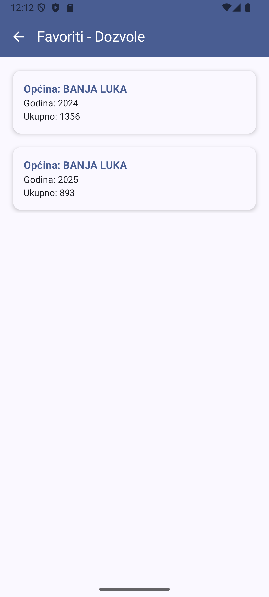

*Korisnik može sačuvati podatke kao favorite i pregledati ih u posebnoj sekciji, dostupno i offline. Sistem favorita omogućava brz pristup često korištenim podacima, podržava organizovanje favorita, te omogućava brzo uklanjanje iz liste favorita. Podaci se čuvaju lokalno i dostupni su bez internet konekcije.*

### 7. Statistika / Vizualizacija podataka (Grafikoni)
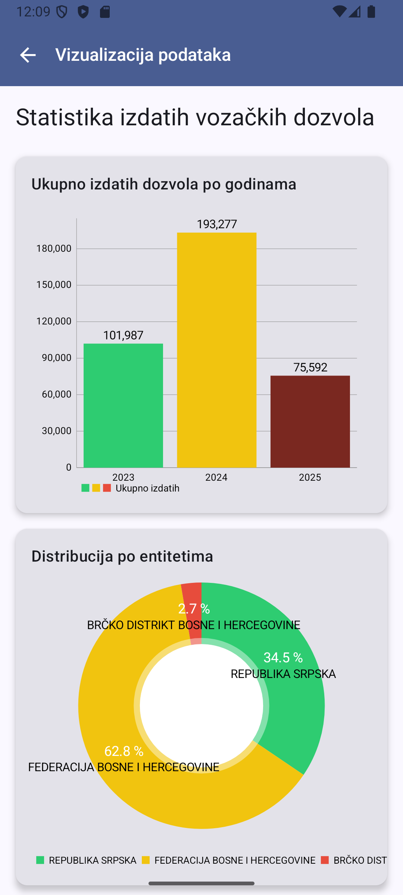
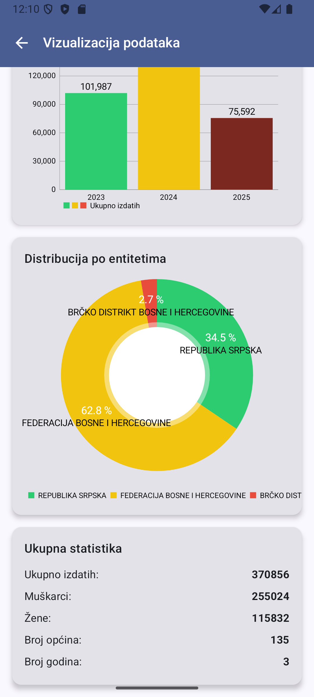
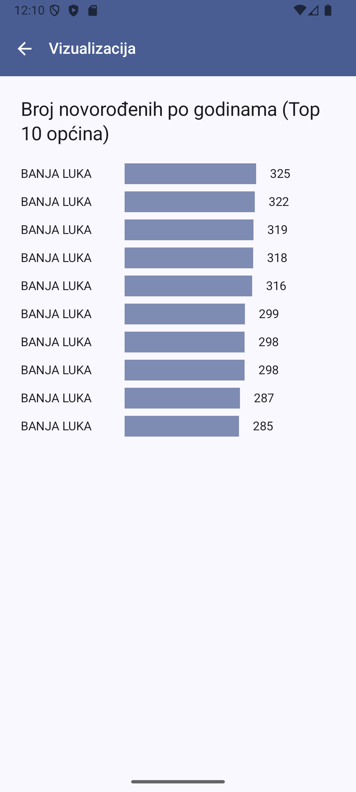

*Prikaz statističkih podataka kroz grafikone (bar chart, pie chart, line chart). Vizualizacija podataka omogućava bolje razumijevanje trendova i obrazaca u podacima. Grafikoni su interaktivni, podržavaju zoom funkcionalnost, te omogućavaju eksport podataka. Različiti tipovi grafikona su prilagođeni različitim vrstama podataka.*

### 8. Podešavanja
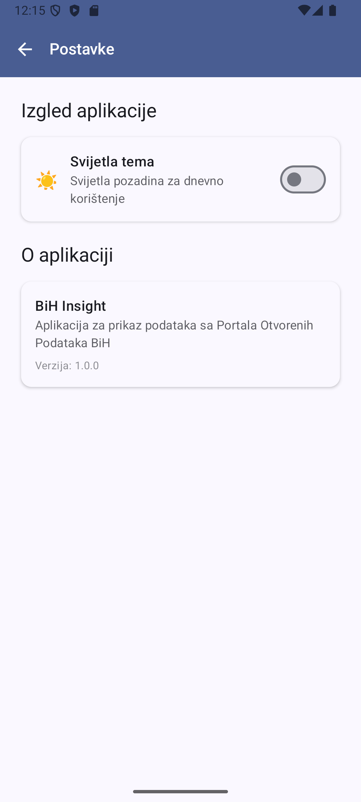

*Ekran za podešavanje preferencija, tema, i drugih opcija aplikacije. Korisnik trenutno na ovome ekranu može promjeniti temu.*

### 9. Tamna tema
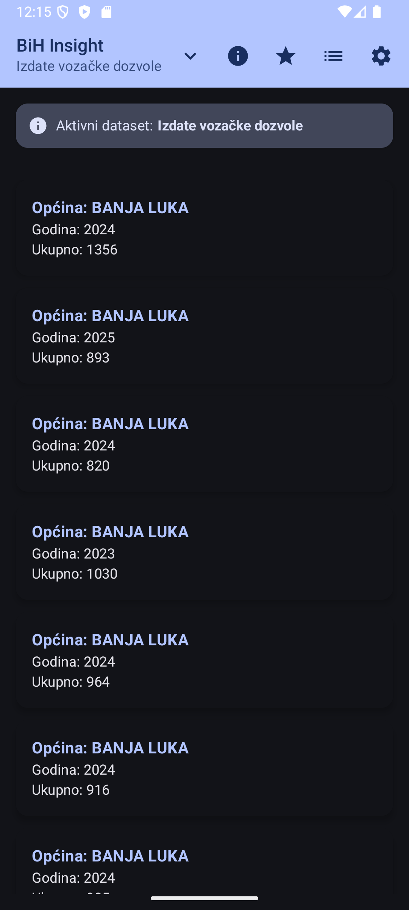

*Aplikacija podržava tamnu temu radi boljeg korisničkog iskustva u uslovima slabog osvjetljenja. Tamna tema je implementirana koristeći Material 3 Design sistem, te omogućava ručno prebacivanje između svijetle i tamne teme.*

---

## Tehnički stack i arhitektura

- **Jezik:** Kotlin - Moderni programski jezik za Android razvoj
- **UI:** Jetpack Compose (Material 3) - Declarative UI framework
- **Arhitektura:** MVVM (Model-View-ViewModel) - Arhitekturni pattern
- **Navigacija:** Navigation for Compose - Upravljanje navigacijom
- **Asinhronost:** Coroutines, Flow - Upravljanje asinhronim operacijama
- **Dohvat podataka:** Retrofit - HTTP klijent za API komunikaciju
- **Lokalna baza:** Room - Lokalna baza podataka
- **Repository pattern** - Jedinstveni izvor podataka
- **State management** - Upravljanje stanjem u Compose

---

## Opis funkcionalnosti ključnih klasa

### ViewModel klase

**IssuedDLCardViewModel** je glavna ViewModel klasa koja upravlja stanjem i logikom za prikaz podataka o izdavanju vozačkih dozvola. Klasa koristi SavedStateHandle za čuvanje stanja kroz konfiguracijske promjene, implementira UiState sealed class za upravljanje različitim stanjima UI-a (Loading, Success, Error), te koordinira komunikaciju između UI-a i Repository sloja.

**Ključne funkcionalnosti:**
- Upravljanje stanjem UI-a kroz StateFlow
- Filtriranje i sortiranje podataka
- Upravljanje favoritima
- Čuvanje stanja kroz konfiguracijske promjene
- Error handling i loading stanja

### Repository klase

**IssuedDLCardRepository** implementira Repository pattern i služi kao jedinstveni izvor podataka za aplikaciju. Klasa koordinira između API servisa i lokalne baze podataka, implementira strategiju "cache-first" gdje se prvo prikazuju keširani podaci, a zatim se ažuriraju sa servera.

**Ključne funkcionalnosti:**
- Dohvaćanje podataka sa API-ja
- Keširanje podataka u lokalnu bazu
- Offline podrška
- Filtriranje i pretraga podataka
- Upravljanje favoritima

### DAO objekti

**IssuedDLCardDao** je Data Access Object koji definiše operacije nad lokalnom bazom podataka. Koristi Room anotacije za definisanje SQL upita, podržava kompleksne upite sa parametrima, te omogućava reaktivno praćenje promjena kroz Flow.

**Ključne funkcionalnosti:**
- CRUD operacije nad bazom podataka
- Kompleksni upiti sa filtriranjem
- Reaktivno praćenje promjena
- Optimizovani upiti za performanse

### Composable funkcije

**IssuedDLCardScreen** je glavna Composable funkcija koja prikazuje listu podataka. Koristi LazyColumn za efikasan prikaz velikih lista, implementira SwipeRefresh za osvježavanje podataka, te koristi StateFlow za reaktivno ažuriranje UI-a.

**Ključne funkcionalnosti:**
- Reaktivni UI sa StateFlow
- Pull-to-refresh funkcionalnost
- Loading i error stanja
- Optimizovani prikaz liste
- Material 3 dizajn

---

## Ključne klase i kodni isječci

### ViewModel primjer
```kotlin
sealed class IssuedDLCardUiState {
    object Loading : IssuedDLCardUiState()
    data class Success(val cards: List<IssuedDLCardEntity>) : IssuedDLCardUiState()
    data class Error(val message: String) : IssuedDLCardUiState()
}

class IssuedDLCardViewModel(
    private val savedStateHandle: SavedStateHandle,
    private val repository: IssuedDLCardRepository
) : ViewModel() {
    private val _uiState = MutableStateFlow<IssuedDLCardUiState>(IssuedDLCardUiState.Loading)
    val uiState: StateFlow<IssuedDLCardUiState> = _uiState.asStateFlow()

    fun fetchIssuedDL() {
        viewModelScope.launch {
            repository.getIssuedDLCardData().collect { data ->
                _uiState.value = if (data.isEmpty()) {
                    IssuedDLCardUiState.Error("Nema podataka za prikaz")
                } else {
                    IssuedDLCardUiState.Success(data)
                }
            }
        }
    }
}
```

### Repository primjer
```kotlin
class IssuedDLCardRepository(
    private val apiService: IssuedDLCardApiService,
    private val dao: IssuedDLCardDao
) {
    fun getIssuedDLCardData(): Flow<List<IssuedDLCardEntity>> = flow {
        try {
            val response = apiService.getIssuedDLCards()
            val entities = response.result.map { it.toEntity() }
            dao.deleteAll()
            dao.insertAll(entities)
            emit(entities)
        } catch (e: Exception) {
            val cached = dao.getAllIssuedDL()
            emit(cached)
        }
    }
}
```

### DAO primjer
```kotlin
@Dao
interface IssuedDLCardDao {
    @Query("SELECT * FROM issued_dl_cards")
    suspend fun getAllIssuedDL(): List<IssuedDLCardEntity>

    @Query("""
        SELECT * FROM issued_dl_cards
        WHERE (:municipality IS NULL OR municipality LIKE '%' || :municipality || '%')
        AND (:year IS NULL OR year = :year)
    """)
    suspend fun filterCombined(municipality: String?, year: Int?): List<IssuedDLCardEntity>
}
```

### Retrofit API Service primjer
```kotlin
interface IssuedDLCardApiService {
    @POST("api/IssuedDLCards/list")
    suspend fun getIssuedDLCards(
        @Header("Authorization") token: String? = null,
        @Body body: LanguageRequest
    ): IssuedDLCardResponse
}
```

### Room Entity primjer
```kotlin
@Entity(tableName = "issued_dl_cards")
data class IssuedDLCardEntity(
    @PrimaryKey(autoGenerate = true)
    val id: Int = 0,
    val entity: String?,
    val municipality: String?,
    val year: Int?,
    val total: Int?,
    val isFavorite: Boolean = false
)
```

### Composable funkcija za prikaz liste
```kotlin
@Composable
fun IssuedDLCardScreen(viewModel: IssuedDLCardViewModel) {
    val uiState by viewModel.uiState.collectAsState()
    
    SwipeRefresh(
        state = rememberSwipeRefreshState(isRefreshing),
        onRefresh = { viewModel.fetchIssuedDL() }
    ) {
        LazyColumn {
            when (uiState) {
                is IssuedDLCardUiState.Success -> {
                    items(uiState.cards) { card ->
                        IssuedDLCardItem(card)
                    }
                }
                is IssuedDLCardUiState.Loading -> {
                    item { CircularProgressIndicator() }
                }
                is IssuedDLCardUiState.Error -> {
                    item { Text(uiState.message) }
                }
            }
        }
    }
}
```

---

## Opis Android/Jetpack koncepata

### Room Database

Room je persistence biblioteka koja pruža apstrakciju nad SQLite bazom podataka. U aplikaciji se koristi za lokalno čuvanje podataka, omogućava offline rad, te pruža reaktivno praćenje promjena kroz Flow. Room automatski generiše SQL kod na osnovu anotacija, što smanjuje mogućnost grešaka i ubrzava razvoj.

**Ključne karakteristike:**
- **Entity klase** - Definišu strukturu tabele
- **DAO interfejsi** - Definišu operacije nad bazom
- **Database klase** - Glavna klasa za upravljanje bazom
- **Type converters** - Konverzija kompleksnih tipova
- **Migrations** - Upravljanje promjenama sheme

### ViewModel i Lifecycle

ViewModel je dizajnirani za upravljanje UI-vezanim podacima koji preživljavaju konfiguracijske promjene. U aplikaciji se koristi za čuvanje stanja UI-a, upravljanje poslovnom logikom, te koordinaciju između UI-a i Repository sloja.

**Ključne karakteristike:**
- **Lifecycle awareness** - Automatsko upravljanje životnim ciklusom
- **SavedStateHandle** - Čuvanje stanja kroz konfiguracijske promjene
- **Coroutine scope** - Upravljanje asinhronim operacijama
- **State management** - Upravljanje stanjem kroz StateFlow

### State Management u Compose

State management u Compose omogućava reaktivno ažuriranje UI-a na osnovu promjena u podacima. Aplikacija koristi StateFlow za upravljanje stanjem, remember za čuvanje lokalnog stanja, te collectAsState za povezivanje StateFlow sa Compose.

**Ključne koncepte:**
- **StateFlow** - Reaktivni stream podataka
- **remember** - Čuvanje stanja kroz recomposition
- **collectAsState** - Povezivanje StateFlow sa Compose
- **derivedStateOf** - Izračunavanje stanja na osnovu drugih stanja

### Coroutines i Flow

Coroutines omogućavaju asinhrono programiranje u Kotlin-u, dok Flow pruža reaktivni stream podataka. U aplikaciji se koriste za upravljanje asinhronim operacijama, dohvaćanje podataka sa API-ja, te reaktivno ažuriranje UI-a.

**Ključne koncepte:**
- **CoroutineScope** - Opseg za izvršavanje coroutines
- **Flow** - Cold stream podataka
- **StateFlow** - Hot stream sa trenutnim stanjem
- **withContext** - Promjena konteksta za izvršavanje

### Retrofit

Retrofit je HTTP klijent koji omogućava komunikaciju sa REST API-jem. U aplikaciji se koristi za dohvaćanje podataka sa Portala Otvorenih Podataka BiH, podržava autentifikaciju, te omogućava definisanje API endpoint-a kroz interfejse.

**Ključne karakteristike:**
- **Interface-based API** - Definicija API-ja kroz interfejse
- **Annotation processing** - Automatsko generisanje koda
- **Type safety** - Sigurnost tipova za request/response
- **Interceptor support** - Dodavanje header-a i logiranja

### Navigation for Compose

Navigation for Compose omogućava upravljanje navigacijom između ekrana u aplikaciji. Koristi declarative pristup za definisanje navigacijskog grafa, podržava argumente između ekrana, te omogućava deep linking.

**Ključne koncepte:**
- **NavGraph** - Definicija navigacijskog grafa
- **NavController** - Upravljanje navigacijom
- **Arguments** - Prosljeđivanje podataka između ekrana
- **Deep linking** - Direktno otvaranje ekrana

### Material 3 Theming

Material 3 je najnovija verzija Material Design-a koja pruža moderni vizuelni identitet i theming sistem. U aplikaciji se koristi za konzistentan dizajn, podršku za tamnu temu, te prilagođavanje različitim veličinama ekrana.

**Ključne karakteristike:**
- **Color scheme** - Definicija boja za temu
- **Typography** - Definicija tipografije
- **Shape** - Definicija oblika komponenti
- **Dark theme** - Podrška za tamnu temu

---

## Uputstvo za pokretanje

1. **Kloniranje repozitorija** - Preuzeti kod sa Git repozitorija
2. **Otvaranje u Android Studio** - Otvoriti projekat u Android Studio IDE
3. **Sync Project with Gradle Files** - Sinhronizovati dependencies
4. **Build & Run** - Pokrenuti aplikaciju na emulatoru ili fizičkom uređaju (API 26+)
5. **Internet konekcija** - Za rad sa podacima potreban je internet, ali favoriti i keširani podaci su dostupni offline

**Sistemski zahtjevi:**
- Android Studio Arctic Fox ili noviji
- Android SDK API 26+
- Kotlin 1.8+
- Gradle 7.0+

---

## Zaključak

Aplikacija BiHInsight demonstrira moderni pristup razvoju Android aplikacija sa fokusom na rad sa otvorenim podacima, offline podršku, vizualizaciju i intuitivan korisnički interfejs. Korištenje najnovijih Android tehnologija kao što su Jetpack Compose, MVVM arhitektura, Room baza podataka i Retrofit omogućava brz razvoj, lako održavanje i skalabilnost aplikacije.

Projekat pokazuje implementaciju svih ključnih koncepata modernog Android razvoja, uključujući reaktivno programiranje sa Coroutines i Flow, upravljanje stanjem u Compose, lokalno čuvanje podataka, te komunikaciju sa web API-jem. Aplikacija je optimizovana za performanse, korisničko iskustvo i održavanje, što je čini prikladnom za produkcijsko okruženje.
